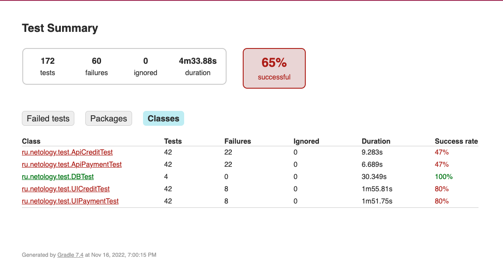

# Отчет по итогам тестирования
В проекте было проведено автоматизированное тестирование сервиса для покупки тура, который
взаимодействует с СУБД MySQL и API банка, опубликованном на внешнем IP-адресе.

## Количество тест-кейсов
Для каждой из форм приложения ("Купить" и "Купить в кредит") было автоматизировано по 86 тестов.
Суммарное количество тестов в проекте - 172.

Из них:
* 42 UI теста;
* 42 API теста;
* 2 теста с запросами в БД.

## Процент успешных и не успешных тест-кейсов
Из 172 тестов:
* 112 завершились успешно;
* 60 завершились ошибкой.

**Итого:** 65% (успешных) / 35% (неуспешных)

## Общие рекомендации
1. Разработать детальную документацию с требованиями к полям обеих форм;
2. Исправить логику работы поля "Месяц" - добавить ограничение на количество символов, добавить проверку на значения "0", "00" и "13";
3. Исправить логику работы поля "Год" - добавить ограничение на количество символов, добавить проверку на значения "0", "00" и "99";
4. Исправить логику работы поля "Владелец" - добавить проверку на заполненность поля, а также на наличие букв кириллицы, цифр и спецзнаков;
5. Исправить логику работы поля "Владелец" - добавить проверку на заполненность поля, а также на количество знаков;
6. Исправить логику появления всплывающего окна с сообщением об одобрении операции.
7. Исправить логику работы приложения с картой, которая помечена как Declined.